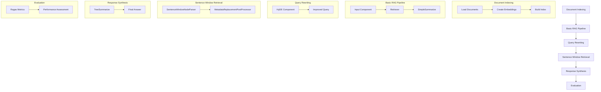

# Advanced RAG Pipeline with LlamaIndex

This project demonstrates an advanced Retrieval-Augmented Generation (RAG) pipeline using LlamaIndex, incorporating various components for improved question-answering performance and evaluation.

## Features

- Document indexing using OpenAI embeddings
- Basic RAG pipeline implementation
- Query rewriting with Hypothetical Document Embeddings (HyDE)
- Sentence window retrieval for improved context
- Multiple response synthesizers (SimpleSummarize and TreeSummarize)
- Pipeline visualization using pyvis
- RAG evaluation using Ragas metrics

## How It Works

1. **Document Indexing**: The project starts by indexing documents from a specified directory using OpenAI's embedding model.

2. **Basic RAG Pipeline**: A basic pipeline is set up with components for input, retrieval, and output synthesis.

3. **Query Rewriting**: A HyDE component is added to improve query understanding and retrieval performance.

4. **Sentence Window Retrieval**: Implements a sliding window approach for more contextual retrieval.

5. **Response Synthesis**: Utilizes both SimpleSummarize and TreeSummarize for generating responses.

6. **Evaluation**: Incorporates Ragas metrics for evaluating the RAG pipeline's performance.

## Pipeline Structure

The following diagram illustrates the structure of our RAG pipeline:

This diagram shows the main components of our pipeline:
1. Document Indexing
2. Basic RAG Pipeline
3. Query Rewriting
4. Sentence Window Retrieval
5. Response Synthesis
6. Evaluation

Each component plays a crucial role in improving the performance and accuracy of our question-answering system.

## Requirements

- Python 3.7+
- LlamaIndex
- OpenAI API key
- Additional dependencies (see `requirements.txt`)

## Setup

1. Clone the repository
2. Install dependencies: `pip install -r requirements.txt`
3. Set up your OpenAI API key in a `.env` file
4. Run the main script: `python main.py`

## Customization

You can easily modify the pipeline by adding, removing, or reordering components in the `QueryPipeline` setup.

## Evaluation

The project uses Ragas metrics for evaluation:
- Faithfulness
- Answer Relevancy
- Context Precision
- Context Recall

These metrics help assess the quality and accuracy of the RAG pipeline's outputs.

